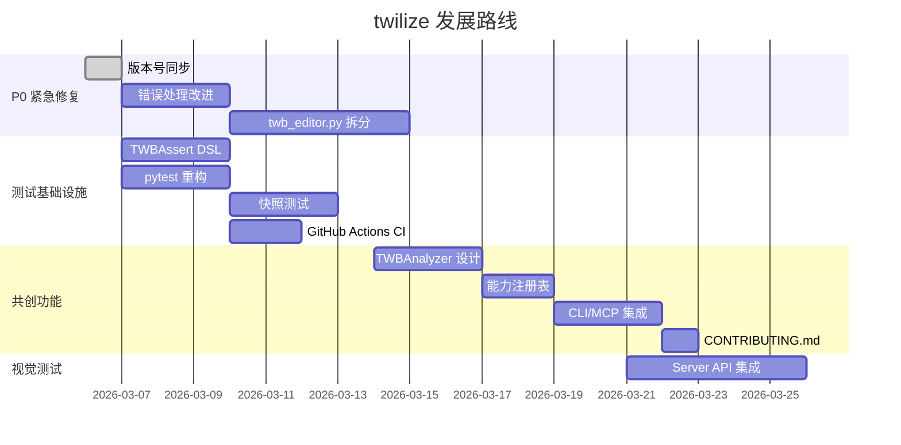

# twilize 项目路线图 & 审核报告

> 最后更新: 2026-03-13
> 目标：持续改进 twilize，建立社区共创生态，构建 Dashboard-as-Code 工程化能力

---

## 一、当前不足分析（按优先级排序）

### 🔴 P0 — 紧急

| # | 问题 | 影响 | 建议 | 状态 |
|---|---|---|---|---|
| 1 | `twb_editor.py` 单文件 2078 行 | 可维护性差，改动容易引发回归 | 拆分为 `parameters.py`、`charts.py`、`dashboards.py` 等模块 | ✅ 已完成 |
| 2 | 错误处理薄弱，大量 `except Exception: pass` | 调试困难，静默失败 | 添加 logging，改为具体异常类型 | 🔄 进行中 |
| 3 | `__init__.py` 版本号 (0.5.0) 与 `pyproject.toml` (0.5.3) 不同步 | 用户困惑 | 使用单一版本源 | ✅ 已完成 |

### 🟠 P1 — 高优先级

| # | 问题 | 影响 | 建议 |
|---|---|---|---|
| 4 | 所有测试都是集成测试，缺少单元测试 | 测试慢、定位问题难 | 建立三层测试架构（详见自动化测试章节） |
| 5 | `FieldRegistry._find_field` 猜测注册逻辑 | 拼写错误不报错 | 区分"严格模式"和"宽松模式" |
| 6 | `twb_editor.py` ↔ `server.py` 循环导入 | 架构耦合 | 提取 `REFERENCES_DIR` 到独立的 `config.py` |

### 🟡 P2 — 中优先级

| # | 问题 | 影响 | 建议 |
|---|---|---|---|
| 7 | 缺少 CI/CD 和代码质量工具 | 社区 PR 质量无保障 | 添加 GitHub Actions + ruff + mypy |
| 8 | 函数体内重复 `import` 语句 | 代码不规范 | 统一移到文件顶部 |
| 9 | `__init__.py` 没有导出核心 API | `from twilize import TWBEditor` 失败 | 添加 `__all__` 导出 |
| 10 | 缺少 TWB XML Schema 验证 | 无法提前发现结构错误 | 实现结构验证器（详见自动化测试章节） |

### 🟢 P3 — 低优先级

| # | 问题 | 影响 | 建议 |
|---|---|---|---|
| 11 | README 示例代码中路径可能过时 | 新用户困惑 | 统一使用零配置模式示例 |
| 12 | `output/` 目录没有 `.gitkeep` | 首次运行可能报错 | 添加 `.gitkeep` |
| 13 | 缺少 `CONTRIBUTING.md` | 社区参与门槛高 | 编写贡献指南 |

---

## 二、TWB 解析器 — 共创功能设计

> 核心思路：解析任意 TWB 文件 → 发现 twilize 未支持的功能 → 社区认领实现

### 架构设计

```
用户提交 TWB 文件
        ↓
  TWBAnalyzer.analyze()     ← 提取该 TWB 使用的所有 Tableau 功能
        ↓
  TWBAnalyzer.diff()        ← 与 SUPPORTED_CAPABILITIES 对比
        ↓
  Gap Report                ← 列出未支持的功能
        ↓
  Issue Templates           ← 自动生成 GitHub Issue 模板
        ↓
  社区认领 → PR → 合并后更新能力表
```

### 需要扫描的 TWB XML 维度

| 维度 | XML 路径示例 | 当前支持 |
|---|---|---|
| Mark 类型 | `//pane/mark/@class` | Bar, Line, Pie, Area, Circle, Square, Text, Map |
| 编码通道 | `//encodings/*` | color, size, text, lod, wedge-size, tooltip, geometry |
| 聚合函数 | `//column-instance/@derivation` | Sum, Avg, Count, CountD, Min, Max, Median, Attr |
| 日期部分 | `//column-instance/@derivation` | Year, Quarter, Month, Day |
| 计算类型 | `//calculation/@class` | tableau (基本计算) |
| 连接类型 | `//connection/@class` | excel-direct, mysql, sqlproxy |
| Dashboard 组件 | `//zone/@type-v2` | worksheet, filter, paramctrl, color |
| 交互类型 | `//action/@type` | filter, highlight |
| 格式化 | `//format/*` | ❌ 未支持 |
| 参考线 | `//reference-line` | ❌ 未支持 |
| 排序 | `//sort/*` | shelf-sort (降序) |
| 趋势线 | `//trend-line` | ❌ 未支持 |
| 表计算 | `//table-calc-*` | ✅ 支持 (add_calculated_field table_calc 参数) |
| 数据桶 | `//bin` | ❌ 未支持 |
| 集(Sets) | `//group[@type='set']` | ❌ 未支持 |
| 参数应用 | `//calculation[contains(@formula,'Parameters')]` | ✅ 支持 |

### 实现计划

1. **`capability_registry.py`** — 定义能力注册表，记录 twilize 已支持的所有功能
2. **`twb_analyzer.py`** — TWB XML 扫描器，提取目标文件使用的所有功能
3. **CLI 命令** — `twilize analyze <path>` 输出能力报告
4. **MCP 工具** — `analyze_twb` 让 AI 也能调用分析

---

## 三、自动化测试方案

### 当前痛点

- 大部分测试是 `main()` 脚本，不能被 `pytest` 自动发现
- 没有隔离的单元测试，每个测试都要加载真实模板文件
- 验证结构全靠手写 XPath，冗长且易出错
- 无法提前知道生成的 TWB 是否能在 Tableau 中正常打开

### 五种验证方法对比

| 方法 | 验证层次 | 需要 Tableau | 自动化程度 | 推荐场景 |
|---|---|---|---|---|
| **A. XML 结构断言 (TWBAssert DSL)** | XML 结构 | ❌ | ⭐⭐⭐⭐⭐ | 日常开发、CI |
| **B. TWB 快照测试** | XML 完整性 | ❌ | ⭐⭐⭐⭐⭐ | 回归检测 |
| **C. XML Schema (XSD) 验证** | XML 格式合规 | ❌ | ⭐⭐⭐⭐ | 发布前校验 |
| **D. Tableau Server REST API** | 视觉渲染 | ✅ Server | ⭐⭐⭐ | 集成测试 |
| **E. Tableau Desktop COM** | 视觉渲染 | ✅ Desktop (Win) | ⭐⭐ | 本地验证 |

### 方法 A：XML 结构断言 DSL（推荐首选 ⭐）

> 用户痛点：「我希望能提前检查结构是否正确」

创建简洁的 TWB 断言工具，覆盖最常见的结构检查：

```python
# tests/twb_assert.py
class TWBAssert:
    """简化的 TWB XML 结构断言工具。"""
    
    def __init__(self, editor):
        self.root = editor.root
        self.editor = editor
    
    def worksheet_exists(self, name):
        """断言工作表存在。"""
        assert self.root.find(f".//worksheet[@name='{name}']") is not None
        return self
    
    def mark_type(self, worksheet, expected):
        """断言图表类型。"""
        ws = self.root.find(f".//worksheet[@name='{worksheet}']")
        mark = ws.find(".//pane/mark")
        assert mark.get("class") == expected
        return self
    
    def has_rows(self, worksheet):
        """断言 rows 非空。"""
        ws = self.root.find(f".//worksheet[@name='{worksheet}']")
        rows = ws.find(".//table/rows")
        assert rows is not None and rows.text
        return self
    
    def has_encoding(self, worksheet, encoding_type):
        """断言存在指定编码通道（color/size/text/lod/wedge-size）。"""
        ws = self.root.find(f".//worksheet[@name='{worksheet}']")
        enc = ws.find(f".//encodings/{encoding_type}")
        assert enc is not None
        return self
    
    def dashboard_contains(self, dashboard, worksheet):
        """断言仪表板包含指定工作表的 zone。"""
        db = self.root.find(f".//dashboard[@name='{dashboard}']")
        zones = db.findall(f".//zone[@name='{worksheet}']")
        assert len(zones) > 0
        return self
    
    def has_parameter(self, name):
        """断言参数存在。"""
        assert name in self.editor._parameters
        return self
    
    def has_filter(self, worksheet, field_contains):
        """断言工作表视图中存在包含指定字段的过滤器。"""
        ws = self.root.find(f".//worksheet[@name='{worksheet}']")
        filters = ws.findall(".//filter")
        found = any(field_contains in f.get("column", "") for f in filters)
        assert found, f"Filter containing '{field_contains}' not found"
        return self
    
    def datasource_dep_has_field(self, worksheet, field_name):
        """断言工作表的 datasource-dependencies 包含指定字段。"""
        ws = self.root.find(f".//worksheet[@name='{worksheet}']")
        deps = ws.find(".//datasource-dependencies")
        cols = deps.findall("column")
        found = any(field_name in c.get("name", "") for c in cols)
        assert found
        return self
    
    def xml_valid(self):
        """基础 XML 完整性检查。"""
        assert self.root.tag == "workbook"
        assert self.root.find("datasources") is not None
        assert self.root.find("worksheets") is not None
        return self
```

**使用示例：**

```python
def test_bar_chart_structure(editor):
    editor.add_worksheet("Sales")
    editor.configure_chart("Sales", mark_type="Bar", 
                          rows=["Category"], columns=["SUM(Sales)"])
    
    (TWBAssert(editor)
        .xml_valid()
        .worksheet_exists("Sales")
        .mark_type("Sales", "Bar")
        .has_rows("Sales")
        .datasource_dep_has_field("Sales", "Category"))
```

### 方法 B：TWB 快照测试

对于关键场景，保存「黄金快照」文件，每次运行测试时与新生成的 TWB 进行归一化比对：

```python
# tests/test_snapshot.py
def normalize_twb(xml_str):
    """移除 UUID、时间戳等不稳定内容。"""
    xml_str = re.sub(r'\{[A-F0-9-]{36}\}', '{UUID}', xml_str)
    xml_str = re.sub(r"source-build='[^']+'", "source-build='NORM'", xml_str)
    return xml_str

def test_bar_chart_snapshot(editor, snapshot_dir):
    editor.add_worksheet("Sales")
    editor.configure_chart("Sales", mark_type="Bar",
                          rows=["Category"], columns=["SUM(Sales)"])
    
    actual = normalize_twb(etree.tostring(editor.root, encoding="unicode"))
    expected = normalize_twb((snapshot_dir / "bar_chart.twb.snap").read_text())
    
    assert actual == expected, "TWB output differs from snapshot"
```

快照更新命令：`pytest --update-snapshots`

### 方法 C：XML Schema (XSD) 验证

Tableau 内部有 XSD Schema 定义了 TWB 的合法结构。可以提取并用于验证：

```python
# tests/test_schema.py
from lxml import etree

def validate_twb_schema(editor, xsd_path):
    """用 Tableau XSD 验证生成的 TWB 结构。"""
    schema = etree.XMLSchema(etree.parse(str(xsd_path)))
    valid = schema.validate(editor.tree)
    if not valid:
        errors = schema.error_log
        raise AssertionError(f"TWB schema validation failed:\n{errors}")
```

> [!NOTE]
> XSD 可以从 Tableau Desktop 安装目录提取（`C:\Program Files\Tableau\<version>\help\`），也可以从互联网获取。需要社区帮忙收集和维护。

### 方法 D：Tableau Server REST API 视觉验证

> 用户方案：「自动上传到 Server 再用浏览器测试」

这是目前唯一能做**视觉层面验证**的可行方案：

```python
# tests/test_visual.py
import tableauserverclient as TSC

class TableauServerTester:
    """上传 TWB 到 Tableau Server 并获取渲染截图。"""
    
    def __init__(self, server_url, token_name, token_value, site_id=""):
        self.auth = TSC.PersonalAccessTokenAuth(token_name, token_value, site_id)
        self.server = TSC.Server(server_url, use_server_version=True)
    
    def publish_and_screenshot(self, twb_path, project_name="Test"):
        with self.server.auth.sign_in(self.auth):
            # 1. 发布工作簿
            project = self._find_project(project_name)
            wb = TSC.WorkbookItem(project.id)
            wb = self.server.workbooks.publish(wb, twb_path, mode="Overwrite")
            
            # 2. 获取所有视图的截图
            self.server.workbooks.populate_views(wb)
            screenshots = {}
            for view in wb.views:
                self.server.views.populate_image(view)
                screenshots[view.name] = view.image  # PNG bytes
            
            # 3. 清理
            self.server.workbooks.delete(wb.id)
            return screenshots
```

**流程：生成 TWB → 打包 TWBX → 上传 Server → 获取截图 → 与基准图对比**

> [!WARNING]
> **局限性**：
> - 需要有 Tableau Server/Cloud 许可（Tableau Public 不支持 API 上传）
> - Server 渲染与 Desktop 可能有细微差异（字体、地图瓦片等）
> - 速度较慢（每次上传+渲染约 10-30 秒）
> - 适合作为 Release 前的 smoke test，不适合日常开发

### 方法 E：Tableau Desktop COM 自动化（仅 Windows）

在 Windows 上，可以通过 COM 接口驱动 Tableau Desktop：

```python
# 仅概念示例，需要 Tableau Desktop 安装
import subprocess
import time

def open_in_tableau_desktop(twb_path):
    """用 Tableau Desktop 打开 TWB 文件并获取截图。"""
    # 启动 Tableau Desktop 打开文件
    proc = subprocess.Popen(["tableau.exe", twb_path])
    time.sleep(10)  # 等待加载
    
    # 使用 pyautogui 或 Win32 API 截图
    import pyautogui
    screenshot = pyautogui.screenshot()
    
    proc.terminate()
    return screenshot
```

> [!CAUTION]
> 此方法非常脆弱，依赖 Tableau Desktop 安装、窗口加载时间、屏幕分辨率。
> 仅建议作为**本地手动验证的辅助工具**，不适合 CI。

### 推荐的测试实施路线

```
Phase 1 (本周): 方法 A (TWBAssert DSL) + pytest conftest.py
    → 立即可用，覆盖结构正确性
    
Phase 2 (下周): 方法 B (快照测试) + 方法 C (XSD 验证)
    → 防止回归，确保格式合规
    
Phase 3 (月底): 方法 D (Server API 视觉测试)
    → Release 前验证视觉效果
    
Phase 4 (持续): GitHub Actions CI
    → 自动运行 Phase 1-2 的测试
```

---

## 四、行动路线图



---

## 如何参与贡献

1. 使用 `twilize analyze <your.twb>` 发现未支持的功能
2. 查看上面的 Gap 表格，找到你感兴趣的功能
3. 创建 Issue 描述你想要添加的功能
4. Fork 仓库，实现功能并添加测试
5. 提交 PR，确保 `pytest` 通过

---

*本文档是 twilize 项目的持续更新路线图，欢迎所有贡献者参与讨论和完善。*

---

## 五、Agent Skills 工作流系统 ⭐ NEW

> 灵感来源: Jeffrey Shaffer (Tableau Visionary 名人堂) 建议的专业化 Agent Skills 工作流

### 核心理念

将 Dashboard 构建过程分解为 4 个专业化阶段，每个阶段有独立的 **Skill 文件**提供领域专家级指导。AI Agent 在执行不同阶段时加载对应 Skill，获得最佳实践指导。

```
Phase 1: calculation_builder  →  参数定义、计算字段、LOD 表达式
Phase 2: chart_builder         →  图表类型选择、编码配置、筛选器
Phase 3: dashboard_designer    →  布局设计、控件面板、交互动作
Phase 4: formatting            →  数字格式、配色、排序、工具提示
```

### Skills 与 Prompts 的区别

| 维度 | Prompts (`examples/prompts/`) | Skills (`src/twilize/skills/`) |
|------|------|------|
| 定位 | 告诉 AI **做什么** | 告诉 AI **怎么做好** |
| 粒度 | 一次性完整任务 | 分阶段专业知识 |
| 加载方式 | 用户复制粘贴 | AI 按需 `read_resource` |
| 内容 | 具体的字段名、公式、布局 | 最佳实践、反模式、检查清单 |

### 技术实现

- Skills 文件位于 `src/twilize/skills/`，随 PyPI 包分发
- 通过 MCP Resources 暴露：`twilize://skills/index` 和 `twilize://skills/{name}`
- AI Agent 调用 `list_resources` 或 `read_resource` 按需加载
- MCP server instructions 已提示 AI 在每个阶段读取对应 Skill

### 后续扩展方向

- [ ] `data_connection.md` — 数据源连接专家技能
- [ ] `accessibility.md` — 无障碍设计技能（色盲友好配色等）
- [ ] `performance.md` — 大数据集性能优化技能
- [ ] 自定义 Skills — 允许用户创建自己的 Skill 文件
## 2026-03-09 Release Update

- Capability registry and TWB gap analysis are now implemented and exposed through the MCP surface.
- Chart handling has been reorganized around focused routing modules and capability-aware dispatch.
- Dashboard and layout internals have been split into smaller modules while keeping the public SDK surface stable.
- MCP server internals have been moved into the `src/twilize/mcp/` package, with `server.py` retained as a compatibility entrypoint.
- The advanced Hyper example now targets the Tableau Advent Calendar `Sample - EU Superstore.hyper` extract and resolves the physical `Orders_*` table name automatically.
